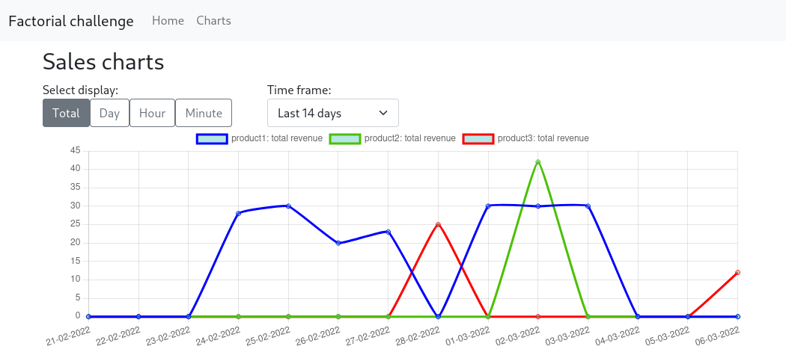

# Factorial technical challenge

## Description

Chart application built on Next.js with SQLite connected through Prisma. Generated charts depend on Chart.js library.

## Live demo

http://factorial-challenge-alberto.herokuapp.com/

## Instructions

_.env_ file is uploaded only to ease the configuration during evaluation and because it doesn't contain any sensitive information.

-   Development:
    -   `npm run dev`
    -   `npx prisma generate` _(in case some model is changed or added in prisma/schema.prisma)_
    -   `npx prisma studio` _(to add, modify and delete the db records easily)_
-   Deployment: npm install && npm run build && npm run start

## Docs and references from main dependencies:

-   Next.js [Link 1](https://nextjs.org/docs/getting-started)

-   ChartJS [Link 1](https://react-chartjs-2.js.org/docs/migration-to-v4) | [Link 2](https://itnext.io/chartjs-tutorial-with-react-nextjs-with-examples-2f514fdc130)

-   Bootstrap [Link 1](https://getbootstrap.com/docs/4.1/getting-started/introduction/) | [Link 2](https://www.kindacode.com/article/how-to-correctly-use-bootstrap-5-in-next-js/)
-   Prisma [Link 1](https://www.prisma.io/nextjs) | [Link 2](https://www.prisma.io/docs/concepts/components/prisma-client/raw-database-access)
-   SQLite [Link 1](https://www.sqlite.org/lang_datefunc.html)
